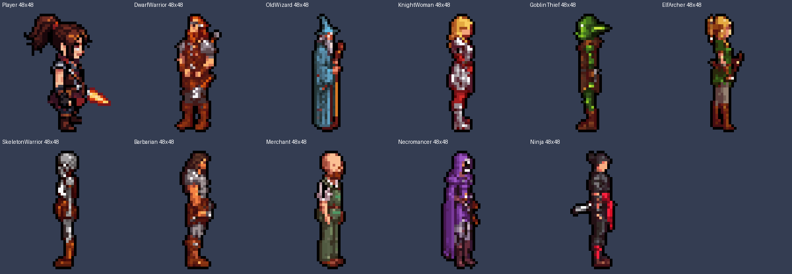

# Local Character Generator

Generate **pixel-art game characters from a text description**, entirely on your own computer: local image models in
ComfyUI, a deterministic pixel-art pipeline, and a reproducible recipe for every character. Optionally it also produces
**rig data** (joints, per-pixel body parts, pixels hidden behind the arms) so an animation tool can animate the
character with its own pixels.


*Ten generated characters (48 px) next to a hand-made reference sprite (left): same scale, feet line and outline.*

```
"Young female rogue, short dark brown hair, dark green hood, leather armor, small dagger"
   -> spec (structured fields) -> fixed-order prompt
   -> ComfyUI (started automatically): SDXL 1.0 + Pixel Art XL, side view from a mannequin guide, 1024x1024
   -> quality gate (one character, in frame, plain background, side view; else the next seed)
   -> pixel art: background/shadow/halo removal, 24-colour palette, pixel grid, black outline, fixed body height
   -> output/Rogue/Rogue.png (48x48) + character.json (recipe) + metadata.json + prompt.txt + references/
   -> (after approval) rig/: joints, body-part map, hidden-pixel underlay, rig.json
```

No cloud API, no account: once ComfyUI and the models are installed, everything runs offline.

## Contents

[Prerequisites](#prerequisites) - [Installation](#installation) - [Configuration](#configuration) -
[Command line](#command-line) - [Generate](#generate-a-character) - [Regenerate, seeds and recipes](#regenerate-seeds-and-recipes) -
[References](#references) - [Quality checks](#quality-checks) - [Benchmarks](#benchmarks) - [Rig data](#rig-data-for-animation) -
[Claude Code](#using-it-from-claude-code) - [Output](#output-structure) - [Consuming characters](#using-the-characters-in-another-project) -
[Extending](#extending) - [Troubleshooting](#troubleshooting) - [Contributing and license](#contributing-and-license) -
[Documentation](#documentation)

## Prerequisites

| | |
|---|---|
| GPU | NVIDIA with CUDA; **8 GB VRAM minimum, 10-12 GB comfortable** (tested on an RTX 3080 10 GB) |
| OS | Windows 10/11 (tested); Linux should work with a git install of ComfyUI |
| ComfyUI | 0.26+ (tested 0.38.0 portable); only built-in nodes, no custom nodes |
| Python | 3.10+ with Pillow and numpy; **ComfyUI's portable build already contains both** and the launchers use it |
| Disk | ~7.5 GB default models (+1.9 GB for rig data), ComfyUI ~6 GB |

Details, VRAM per profile and timings: [docs/setup.md](docs/setup.md).

## Installation

```bash
git clone <this repository> local-character-generator      # or copy the folder anywhere
cd local-character-generator
```

1. **ComfyUI**: download the portable NVIDIA build from <https://github.com/comfyanonymous/ComfyUI/releases> and
   extract it to `C:\AI\ComfyUI` (the folder with `python_embeded\` and `ComfyUI\main.py`). Elsewhere: put
   `{"comfyui": {"root": "D:/path/to/ComfyUI"}}` into `config/config.local.json`, or set `CHARGEN_COMFYUI_ROOT`.
2. **Models** (downloaded only when you ask; licenses in [docs/licenses.md](docs/licenses.md)):
   ```bash
   ./character-generator models install --group sdxl    # SDXL 1.0 + Pixel Art XL + LCM LoRA (~7.5 GB): required
   ./character-generator models install --group rig     # SDPose-Wholebody (1.9 GB): only for rig data
   ```
   Or download the files listed in [`config/models.json`](config/models.json) into `ComfyUI/models/<folder>/` yourself.
3. **Check**: `./character-generator doctor` (Python, ComfyUI, models per profile, output folder) and
   `python -m unittest discover -s tests` (offline tests, a few seconds).

Launchers: `./character-generator` (Git Bash/Linux), `character-generator.cmd` (cmd/PowerShell), or
`<python> character_generator.py ...`. They pick `CHARGEN_PYTHON`, else ComfyUI's embedded Python, else `python`.

**Starting ComfyUI** is automatic: when nothing answers on `http://127.0.0.1:8188` the tool starts the portable build
(hidden, log in `runs/comfyui.log`, `--reserve-vram 1.5`) and stops it afterwards; a ComfyUI you started yourself is
used and left running. Manual: `./character-generator comfy start|status|stop` or ComfyUI's `run_nvidia_gpu.bat`.

## Configuration

| Where | What |
|---|---|
| `config/config.json` | ComfyUI URL/root/start options, output folder (`output/`), generation defaults (size 48, body ratio, feet margin, 24 colours, black outline, profile), rig-step parameters |
| `config/config.local.json` | per-machine overrides of any key (git-ignored) |
| env | `CHARGEN_COMFYUI_ROOT`, `CHARGEN_COMFYUI_URL`, `CHARGEN_PYTHON`, `CHARGEN_PROJECT` |
| `config/profiles.json` | generation profiles: `quality` (default), `fast`, `nova`, `krea2` (16 GB+), `smoke` |
| `config/models.json` | model manifest (files, URLs, sizes, licenses, checksums) |
| a **project file** | `character-generator.project.json` in a consuming project: output folder, defaults, reference sprite; passed with `--project` ([docs/integration.md](docs/integration.md)) |

## Command line

```
character-generator [--project <file|folder>] [--json] <command> [options]
```

| Command | Purpose |
|---|---|
| `generate` | description or spec -> character folder |
| `regenerate` | re-render a saved character, make variants, `--verify` reproduction, `--from-raw` re-cut without GPU |
| `rig` | rig data for an approved side-view character (`--verify`, `--from-saved`) |
| `migrate-names` | rename the `character.png` of folders made before 0.4.0 to `<Name>.png` (keeps the `.meta`) |
| `parse` | show the structured spec and prompts for a description (no GPU) |
| `check` | sprite metrics (height, feet row, alpha, outline, halo, noise) vs a reference |
| `pixelate` | run only the pixel-art processing on any image |
| `benchmark` | compare profiles and seeds at final sprite sizes |
| `doctor`, `models list/install`, `comfy status/start/stop` | setup and maintenance |

Every option: [docs/usage.md](docs/usage.md#command-reference). `--json` prints machine-readable results (exit code 0 =
success).

## Generate a character

```bash
./character-generator generate --name Rogue --description "Young female rogue, short dark brown hair, dark green hood, lightweight leather armor, small dagger, slim athletic body, confident expression"
./character-generator generate --spec examples/specs/KnightWoman.json            # structured spec (recommended)
./character-generator generate --name Rogue --description "..." --fast --variant  # ~5 s, as a variant
./character-generator generate --name Rogue --description "..." --size 96         # bigger sprite, same layout
```

The first run takes ~30 s (ComfyUI start + model load), then ~15 s per character. Produced files:

```
output/Rogue/
  Rogue.png                  48x48 sprite (<Name>.png, unique per character): transparent, 45 px body, feet on row 46, black outline, faces right
  character.json             the recipe: spec + generation settings + exact prompts
  prompt.txt                 positive / negative prompt
  metadata.json              models + licenses, workflow and guide hashes, seed, timings, VRAM, quality check, hashes
  references/source_raw.png  the 1024 px generation (source for re-cuts and rig data)
runs/<timestamp>_Rogue_quality_s<seed>/   workflow_api.json, raw.png, sprite.png, preview.png (8x, for review)
```

The character spec format (identity, appearance, equipment lists, `avoid`, `view`, ...) is in
[docs/usage.md](docs/usage.md#character-spec); examples in [`examples/specs/`](examples/specs/).

## Regenerate, seeds and recipes

* Every character has a **seed** (random unless `--seed`); if the quality gate rejects seed N, N+1, N+2, ... are tried
  and the accepted seed is stored.
* `character.json` is the **recipe**: spec, generation settings and the exact prompts (frozen, so later template
  changes do not alter saved characters). Same recipe + same models + same ComfyUI = **the same image, byte for byte**.

```bash
./character-generator regenerate --name Rogue --verify                     # reproduce and compare (writes nothing)
./character-generator regenerate --name Rogue --seed 1234                  # variation -> variants/
./character-generator regenerate --name Rogue --variation "red cape"       # variation with extra prompt text
./character-generator regenerate --name Rogue --seed 1234 --replace        # make it the main character
./character-generator regenerate --name Rogue --from-raw --size 96 --replace   # re-cut without the GPU
./character-generator regenerate --name Rogue --from-raw --mirror --replace    # flip a left-facing character
```

## References

`--reference <image>` stores an image with the character (`references/`, recorded in `metadata.json`). The current
profiles are text-to-image and do not use it yet; it is reserved for future identity/style-reference workflows
([docs/extending.md](docs/extending.md)). Every character's own 1024 px generation is kept in
`references/source_raw.png`.

## Quality checks

* **Automatic gate** on every generation: one figure (no sprite sheets), not cropped, plain background, and for side
  views not a front/back view; failures re-roll the seed (`--attempts`, default 6), a final failure is reported in
  `warnings`.
* **`check`** measures a sprite against a reference sprite: body height, feet row, hard alpha, outline darkness, halo,
  detail density, islands. `check output/Rogue/Rogue.png --reference my_hero.png`
* **Acceptance sheet**: `<python> scripts/acceptance.py --reference my_hero.png Name1 Name2 ...` puts characters next to
  the reference, compares six outline/palette settings and writes metrics.
* How the gate and the pixel-art processing work: [docs/pipeline.md](docs/pipeline.md).

## Benchmarks

```bash
./character-generator benchmark --spec examples/specs/Rogue.json --profiles quality,fast,nova --seeds 1,2,3 --sizes 48,64,128
```

Renders every profile x seed, cuts every size, writes `runs/bench_<timestamp>/` with `results.json` (time, VRAM, prompt)
and `contact_sheet.png`. The model choice and the 10-character acceptance test are documented in
[docs/model-benchmark.md](docs/model-benchmark.md).

## Rig data for animation

```bash
./character-generator rig --name Rogue            # after approval; side views; ~30 s
```

Adds `rig/` to the character: `joints.txt`, `parts.png` (body-part bitmask per pixel), `underlay.png` (the torso
behind the near arm, reconstructed with the character's own model, prompt and seed), `rig.json` (format
`chargen-rig/1`, with hints such as a small leg swing for robes). The sprite is never changed; `rig --verify` reproduces
the data byte for byte. Format: [docs/rig-data.md](docs/rig-data.md). Why and how it was validated:
[docs/animation-investigation.md](docs/animation-investigation.md).


## Using it from Claude Code

A Claude Code **skill** lets you work in plain language: "generate character: ...", "generate character fast: ...",
"make a variant of X with a blue cape", "prepare X for animation". The skill turns the description into a spec, calls
this CLI with `--json`, looks at the preview, fixes obvious problems (facing, wrong items, re-rolls), reports, and runs
`rig` after you approve.

* Install: copy [`integrations/claude-code/generate-character/`](integrations/claude-code/generate-character/) to
  `<your project>/.claude/skills/generate-character/` and fill in the two placeholders (path to the generator, project
  file folder).
* How the skill works, what it expects, example prompts, and how to add commands:
  [docs/claude-skill.md](docs/claude-skill.md).

## Output structure

```
<output root>/<Name>/
  <Name>.png  character.json  prompt.txt  metadata.json
  references/source_raw.png  references/<your reference>
  variants/<Name>_<profile>_s<seed>.png | .json | _raw.png
  rig/rig.json  rig/joints.txt  rig/parts.png  rig/parts_preview.png  rig/underlay.png
  rig/source/keypoints.json  rig/source/arm_mask.png  rig/source/inpaint_raw.png
```

The output root is `output/` in this folder, or the `output_root` of a project file (e.g. a game's asset folder).
Field-by-field descriptions: [docs/usage.md](docs/usage.md#output-structure), [docs/rig-data.md](docs/rig-data.md).

## Using the characters in another project

This repository and the projects that use it are **separate repositories**, usually side by side
(`Projects/local-character-generator/`, `Projects/MyGame/`). A character folder is plain PNG + JSON + text; no code
from this repository is needed to read it, and the consuming project contains no generator code.

1. Write a `character-generator.project.json` in your project (output folder, canvas size, palette, outline, reference
   sprite, and `"generator": "../local-character-generator"` so your tools can find this CLI) and call the CLI with
   `--project <that folder>`.
2. Import the PNGs **without filtering or compression** (nearest/point), pivot bottom-centre.
3. For animation, read `rig/` ([docs/rig-data.md](docs/rig-data.md#using-it-consumers)).

[docs/integration.md](docs/integration.md) shows a complete Unity integration (an import postprocessor and an editor
window that calls the CLI).

## Extending

Models, profiles and workflows are data: add a model to `config/models.json`, a ComfyUI API workflow with
`{{placeholders}}` to `workflows/`, and a profile to `config/profiles.json`; prompt wording lives in `prompts/`, the
side-view mannequins in `chargen/guide.py`. Step by step: [docs/extending.md](docs/extending.md).

## Troubleshooting

Start with `character-generator doctor`. Common issues: ComfyUI not found (set its root), missing models (`models
install --group ...`), a generation stuck at 100 % GPU (full VRAM: close other GPU programs; the tool already decodes
tiled and reserves VRAM), noise images after switching profiles (handled automatically), wrong view or facing
(re-roll / `--mirror`). Full list: [docs/troubleshooting.md](docs/troubleshooting.md).

## Contributing and license

* **Code: MIT License** ([LICENSE](LICENSE)). Use, modify, extend and redistribute it freely, also commercially.
  Contributions are accepted under the same license; see [CONTRIBUTING.md](CONTRIBUTING.md) (setup, tests, guidelines)
  and record user-visible changes in [CHANGELOG.md](CHANGELOG.md).
* **Models are not covered by the MIT License.** Each model has its own license (SDXL and Pixel Art XL: OpenRAIL; Krea 2:
  revenue-capped; ...), and those licenses govern how you may use the images. Overview: [docs/licenses.md](docs/licenses.md).
* Never commit model files; add them to `config/models.json`.

## Documentation

| Document | Contents |
|---|---|
| [docs/setup.md](docs/setup.md) | prerequisites, GPU/VRAM, ComfyUI location and start, models, first test |
| [docs/usage.md](docs/usage.md) | every command and option, spec format, seeds/recipes, references, sizes, rig command, output structure |
| [docs/pipeline.md](docs/pipeline.md) | how it works: prompts, profiles/workflows, side-view guide, quality gate, pixel-art processing, rig step, code map |
| [docs/rig-data.md](docs/rig-data.md) | the `chargen-rig/1` format for animation tools |
| [docs/extending.md](docs/extending.md) | new models, profiles, workflows, prompts, guides; tests |
| [docs/integration.md](docs/integration.md) | project files, consuming characters, the Unity example |
| [docs/claude-skill.md](docs/claude-skill.md) | the Claude Code skill |
| [docs/troubleshooting.md](docs/troubleshooting.md) | problems and fixes |
| [docs/model-benchmark.md](docs/model-benchmark.md) | model choice, benchmarks, 10-character acceptance test |
| [docs/animation-investigation.md](docs/animation-investigation.md) | why rig data, prototype results, integration plan |
| [docs/licenses.md](docs/licenses.md) | code vs. model licenses |

## Folder layout

| Path | What |
|---|---|
| `character_generator.py`, `character-generator`, `character-generator.cmd` | entry point and launchers (also `python -m chargen`) |
| `chargen/` | implementation ([code map](docs/pipeline.md#code-map)) |
| `config/` | settings, profiles, model manifest |
| `workflows/`, `prompts/` | ComfyUI API workflows, prompt templates |
| `references/guides/` | side-view mannequins (generated, deterministic) |
| `examples/specs/` | example character specs |
| `integrations/claude-code/` | Claude Code skill template |
| `scripts/acceptance.py` | acceptance sheet |
| `tests/` | offline unit tests |
| `output/`, `runs/` | default output and per-run working files (git-ignored) |

Version 0.3.0 ([CHANGELOG.md](CHANGELOG.md)). Tested on Windows 11, RTX 3080 10 GB, ComfyUI 0.38.0.
