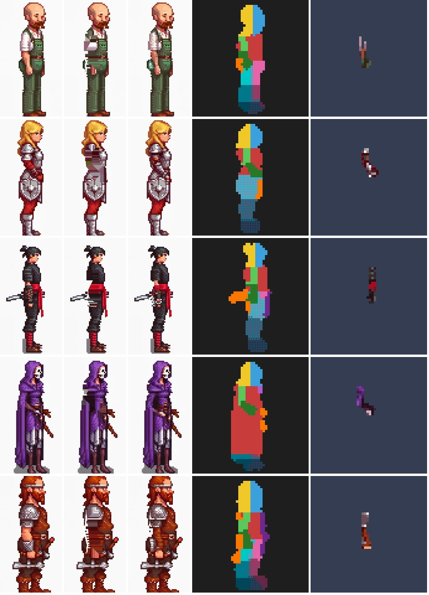

# Rig data (`chargen-rig/1`)

`character-generator rig --name <Name>` adds animation-ready data to an approved **side-view** character. It never
changes the sprite (`<Name>.png`): everything is computed on the 1024 px source image and sampled onto exactly the sprite's
pixel grid, so it lines up with the sprite pixel for pixel. Consumers (a rig/animation tool, a game) can use any part
of it and ignore the rest.

```
<Name>/rig/
  rig.json              everything below + decisions, checks, hashes, the recipe of this step
  joints.txt            joints as plain text
  parts.png             body-part bitmask per pixel
  parts_preview.png     colour picture of the part map (x8), for people only
  underlay.png          pixels hidden behind the near arm / weapon (transparent elsewhere)
  source/keypoints.json SDPose output (OpenPose frame, 1024 px source coordinates)
  source/arm_mask.png   the area that was reconstructed (1024 px)
  source/inpaint_raw.png  the reconstructed 1024 px image
```


*Per character: source, inpainting start (arm area pre-filled), inpainting result (arm removed), part map, sprite with
the underlay drawn on top (what the torso looks like behind the arm).*

## Coordinates

Sprite pixels, origin top-left, **y down**; the character faces **right**; the ground line is `sprite.ground_y`
(= feet row + 1). A pixel `(x, y)` covers `[x, x+1) x [y, y+1)`. Engines with a bottom-left origin flip y.

## Body parts

14 parts, bit `i` = part `i` (this order is part of the format):

| bit | part | bit | part |
|---|---|---|---|
| 0 | Body | 7 | ArmFarLower |
| 1 | Head | 8 | LegNearUpper |
| 2 | Hair | 9 | LegNearLower |
| 3 | ArmNearUpper | 10 | FootNear |
| 4 | ArmNearLower (forearm + hand) | 11 | LegFarUpper |
| 5 | Weapon | 12 | LegFarLower |
| 6 | ArmFarUpper | 13 | FootFar |

"Near" = the body side facing the viewer (drawn in front), "far" = the side behind. `parts.png` is RGBA: **R = bits
0-7, G = bits 8-15, B = 0, A = 255 where the sprite is opaque** (0 elsewhere). Every opaque sprite pixel has at least
one bit. A pixel can carry a near and a far leg bit together where the two legs overlap in the sprite (both legs
need those pixels when they separate). Outline pixels belong to the part they outline.

Decode (Python): `mask = R | (G << 8)` where `A > 0`. `chargen.rig.decode_parts(path)` does it.

## Joints

`rig.json -> joints` (and `joints.txt`, one `Name x y` per line plus `ground y`):

| Joint | Meaning |
|---|---|
| Neck, Hip | neck point; mid-hip |
| HairPivot | rotation point of the hair (back of the head) |
| ShoulderNear, ElbowNear, HandNear / ...Far | arm chains (hand = wrist) |
| KneeNear, FootNear / KneeFar, FootFar | leg chains (foot = ankle) |
| WeaponPivot, WeaponTip | the **grip**: centre of the item pixels that share an edge with the near hand (so the item turns where the hand holds it and keeps touching it; the SDPose wrist is only an estimate), else the item pixel nearest to the hand; the tip is the item pixel farthest from the pivot (both = HandNear when there is no weapon) |

Each joint in `rig.json` has `x`, `y`, `source` (`sdpose`, `part map`, ...) and `confidence` (SDPose score of the
keypoint; `null` for derived joints).

## Underlay (hidden pixels)

`underlay.png` has the sprite's size. Where it is opaque it gives the colour of the pixel **behind** the near arm or
weapon at that position; it is transparent everywhere else. Only pixels that lie over the torso are filled (where the
arm hangs in front of the background there is nothing behind it). A consumer draws these pixels as part of the Body,
underneath the arm, so a swinging arm reveals torso instead of a hole.

How it is made: the near arm and weapon area (over the torso) is pre-filled from the surrounding torso colours, then
re-sampled with the character's own checkpoint, LoRA, prompt and seed (inpainting, denoise 0.55, extra negatives
against arms and hands); pixels outside the area are kept byte-exact. The result is sampled onto the sprite grid with
the sprite's palette, and any colour that does not occur on the visible torso is replaced by a neighbouring torso
colour (`underlay.recoloured_to_torso_colours` counts these).

## rig.json fields

| Field | Content |
|---|---|
| `format` | `chargen-rig/1` |
| `generator_version`, `created`, `character` | |
| `sprite` | `file`, `sha256` (the sprite this data belongs to), `size`, `coordinates`, `facing`, `ground_y`, `feet_row` |
| `joints` | see above |
| `parts` | `file`, `encoding`, `bits` (names in bit order), `pixel_counts`, `overlap` |
| `underlay` | `file`, `pixels`, `recoloured_to_torso_colours`, `covers`, `palette`; `null` with `--no-underlay` |
| `decisions` | `near_side` (which SDPose side is visible), `side_confidence`, `robed`, `weapon_found`, `far_hand_item`, `weak_keypoints`, `figure_height_source_px` |
| `animation_hints` | `leg_swing_scale` (0.3 for robed characters: swing the legs only a little so the robe stays one silhouette; 1.0 otherwise), `note` |
| `warnings` | e.g. low-confidence keypoints on the near side, near/far hard to tell apart |
| `recipe` | SDPose model + workflow hash, keypoint hash, analysis parameters, inpainting (workflow + hash, profile, params, seed, prompts, denoise, mask growth, start), source raw hash |
| `files`, `sha256` | relative paths and hashes of `parts.png` / `underlay.png` |

## How the parts are decided

1. **Keypoints**: SDPose-Wholebody (OpenPose body-18) on the 1024 px source.
2. **Near side**: the body side whose shoulder, elbow, wrist and ear have the higher mean confidence (in a profile the
   hidden side's points are guesses with lower scores, often placed in front of the body). Near arm and near leg are
   on that side.
3. **Head / Hair**: figure pixels above the neck; hair = head pixels behind the ear.
4. **Near arm**: capsules around shoulder-elbow and elbow-wrist plus a hand disc (radii as shares of the figure
   height in `config/config.json -> rig`), upper vs lower by the closer segment.
5. **Weapon**: figure pixels outside head, near arm, torso core and leg capsules that are connected to the near hand;
   an item connected to the far hand moves with the far arm.
6. **Legs**: every figure pixel below the hip and near the legs goes to the nearer leg chain (both legs where the two
   are about equally near); upper/lower/foot by the knee and ankle heights. **Robed characters** (guide build
   `robed` or robe/gown/dress in the clothing): only the pixels near the ankles become feet, the robe stays Body.
7. **Far arm**: only where it sticks out of the torso (behind the torso it is invisible); the rest is **Body**.
8. **Attachment on the sprite grid** (`attach_held_items`, after sampling onto the 48 px grid, where thin links can
   vanish): every moving piece must stay attached to the part that moves it.
   * A far-arm piece with no visible upper arm (an item in a hand hidden behind the torso or legs) has nothing visible
     to hang from: it becomes **Body**.
   * Each arm part is one edge-connected piece; a stray fragment (e.g. forearm pixels up at the shoulder) takes the
     label most common around it.
   * Every Weapon piece must share an edge with the near hand (ArmNearLower) or with a piece that does; corner-only
     contact does not count (a one-pixel link breaks when the item rotates). Gaps of up to `held_item_max_gap_px`
     (3) Body or leg pixels are bridged (to the hand: ArmNearLower; between item pieces: Weapon); a piece that still
     cannot be reached joins the upper arm it touches, else Body.
   * Underlay pieces that touch no visible Body pixel are dropped (they would stand alone in front of the legs).
   What changed is reported in `rig.json -> decisions.held_items`. Validated on 12 characters: no held item, far-hand
   item or limb fragment floats in Idle/Walk/Run/Attack/Jump/Sit/Crouch/CrouchWalk (see
   [animation-investigation.md](animation-investigation.md)).

## Reproducibility

* `rig --verify` re-runs SDPose and the inpainting (ComfyUI cache cleared) and compares keypoints, joints, part map and
  underlay with the stored files: identical on this machine (`all_identical: true`).
* `rig --from-saved` rebuilds everything from `source/keypoints.json` and `source/inpaint_raw.png` without the GPU
  (e.g. after changing analysis parameters).
* `rig.json -> sprite.sha256` ties the data to one sprite. After the sprite changed (e.g. `regenerate --from-raw
  --size 64 --replace`), run `rig` again; the rig step refuses to run if the sprite does not match its recipe.

## Limits

* Side views only; three-quarter views are not detected automatically and rig poorly (re-roll them first).
* The weapon search follows connectivity, so a long cape edge or strap touching the hand can be taken as a weapon
  (it then moves with the hand, attached).
* The underlay reconstructs only what the near arm/weapon hides; the far arm and hair behind the head have no hidden
  pixels.

## Using it (consumers)

Minimal consumer: load the sprite, decode `parts.png` into a per-pixel part mask, load `joints.txt`, build a bone
hierarchy (Body -> Head -> Hair; Body -> arms -> weapon; legs from the root), rotate parts about their joints, draw
back to front with nearest sampling, and draw `underlay.png` pixels as Body pixels beneath the arms. Apply
`animation_hints.leg_swing_scale` to the leg rotations. The AI Sprite Animation package (1.7.0, `ChargenRigImporter`) is
such a consumer; how it uses each file and the validation are in [animation-investigation.md](animation-investigation.md).
A consumer should check `format`, `sprite.size` and `sprite.sha256` and refuse data made for another sprite.
